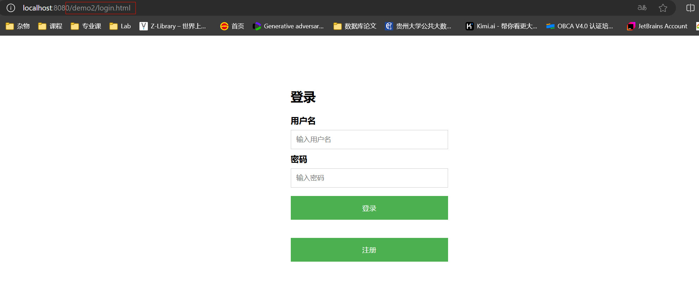
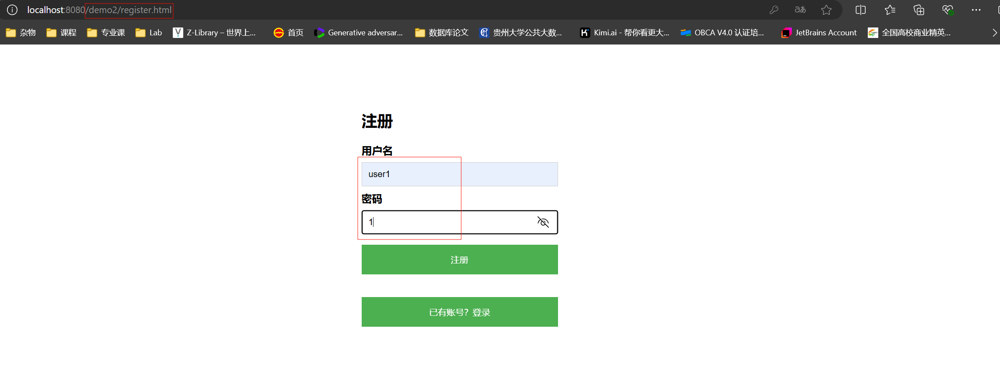
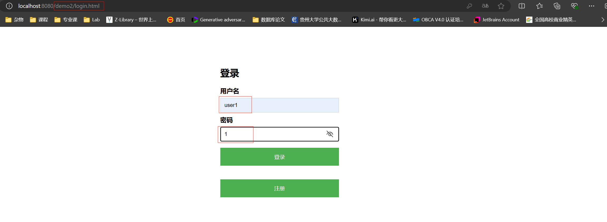
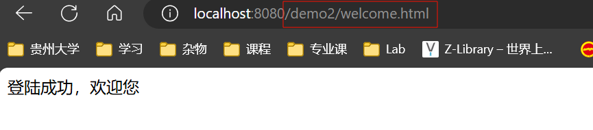
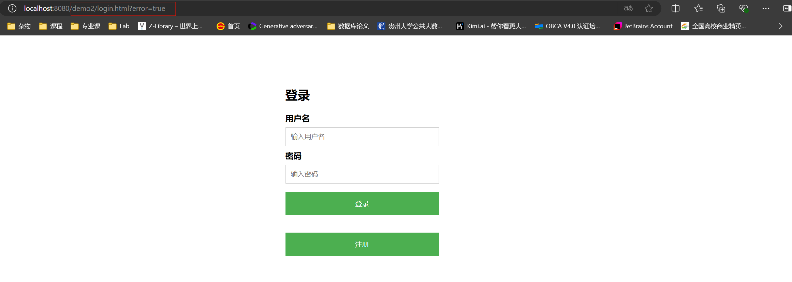

**题目:** 实现一个登录验证过滤器

**目标:** 创建一个 Servlet的 过滤器,用于验证用户是否已登录。对于未登录的用户,将其**重定向**到登录页面。

**要求:** 

一、创建一个名为 `LoginFilter` 的类, 实现 `javax.servlet.Filter` 接口。

二、使用 `@WebFilter` 注解配置过滤器,使其应用于所有 URL 路径 ("/*")。

三、在 `doFilter` 方法中实现以下逻辑: 

1. 检查当前请求是否是对登录页面、注册页面或公共资源的请求。如果是,则允许请求通过。 
2. 如果不是上述情况,检查用户的 session 中是否存在表示已登录的属性(如 "user" 属性)。
3. 如果用户已登录,允许请求继续。 
4. 如果用户未登录,将请求重定向到登录页面。

四、创建一个排除列表,包含不需要登录就能访问的路径(如 "/login", "/register", "/public")。

五、实现一个方法来检查当前请求路径是否在排除列表中。

六、添加适当的注释,解释代码的主要部分。


**作业内容**

##### 一、LoginFilter.java文件内容

LoginFilter.java

```java
package com.gzu;

import javax.servlet.*;
import javax.servlet.annotation.WebFilter;
import javax.servlet.http.HttpServletRequest;
import javax.servlet.http.HttpServletResponse;
import javax.servlet.http.HttpSession;
import java.io.IOException;
import java.util.Arrays;
import java.util.List;

import static jdk.jfr.internal.JVM.isExcluded;

@WebFilter(filterName = "LoginFilter", urlPatterns = "/*")
public class LoginFilter implements Filter {

    private static final String[] exclude_path = {"Login", "Register", "login.html", "register.html"};

    private boolean isExcluded(String requestPath) {
        for (String path : exclude_path) {
            if (requestPath.contains(path)) {
                return true;
            }
        }
        return false;
    }

    @Override
    public void doFilter(ServletRequest request, ServletResponse response, FilterChain chain) throws IOException, ServletException {
        HttpServletRequest req = (HttpServletRequest) request;
        HttpServletResponse res = (HttpServletResponse) response;

        String requestPath = req.getRequestURI();                                   // 获取请求路径

        if (isExcluded(requestPath)) {
            chain.doFilter(request, response);
        } else {
            HttpSession session = req.getSession(false);                        // 检查用户是否登录
            if (session != null && session.getAttribute("user") != null) {
                chain.doFilter(request, response);                              // 用户登陆后进行下一步操作
            } else {
                System.out.println(req.getContextPath());
                res.sendRedirect("login.html");                                 // 用户未登录则重定向登录界面
            }
        }
    }

    @Override
    public void init(FilterConfig filterConfig) throws ServletException {
//        Filter.super.init(filterConfig);
    }

    @Override
    public void destroy() {
//        Filter.super.destroy();
    }
}

```


##### 二、实现功能及演示

###### 1、登录页面



###### 2、注册界面



注册账号后自动跳转登录界面

###### 3、登录已有账号



###### 4、登录成功后跳转欢迎界面



###### 5、登录失败时跳转登录界面并显示错误信息

